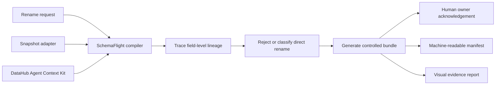

# SchemaFlight

**A blast-radius-aware compiler for schema migrations, grounded in DataHub.**

A column rename can look local in a pull request while silently breaking models, exports, and dashboards two hops away. SchemaFlight reads schema, field-level lineage, ownership, and recorded queries; rejects an unsafe direct rename; and emits an evidence-linked expand/migrate/contract bundle.

Built for **Build with DataHub: The Agent Hackathon**, in the **Metadata-Aware Code Generation & Development** category. The implementation uses the official DataHub Agent Context Kit in live mode and a deterministic snapshot adapter for a zero-infrastructure demo.

## What comes out

For `shop.customer.email -> primary_email`, the included ecommerce graph discovers `analytics.customer_360` and `retention_dashboard`, routes acknowledgements to their owners, patches a recorded query, and creates:

| Artifact | Purpose |
| --- | --- |
| `01_expand.sql` | Add/backfill the new field and expose a compatibility view. |
| `02_migrate.sql` | Reconcile the backfill while callers dual-write and migrate. |
| `03_contract.sql` | Rebuild the view and remove the old field after acknowledgement. |
| `checks.sql` | Gate contraction on a zero-row validation result. |
| `rollback.sql` | Reverse the pre-contract rollout. |
| `query_patches/*.sql` | Patch evidence-linked downstream queries. |
| `impact-manifest.json` | Machine-readable lineage, owners, tags, and query evidence. |
| `migration-decision.md` | Human review and acknowledgement record. |
| `report.html` | Self-contained visual evidence report for review. |

SchemaFlight generates artifacts; it never executes them against a production database.

## Reproduce the demo

Python 3.11-3.13 is supported. Create and activate an isolated environment first.

PowerShell:

```powershell
py -3.13 -m venv .venv
.\.venv\Scripts\Activate.ps1
```

POSIX shells:

```sh
python3.13 -m venv .venv
. .venv/bin/activate
```

Then compile the checked-in snapshot and run all controls:

```console
python -m pip install -e ".[dev]"
python -m schemaflight compile --catalog examples/ecommerce/catalog.json --request examples/ecommerce/rename-email.json --output examples/ecommerce/generated
python -m pytest
python -m ruff check .
```

The compile command returns this machine-readable summary:

```json
{"assets_impacted": 2, "direct_rename_allowed": false, "output": ".../examples/ecommerce/generated", "risk": "high"}
```

Open `examples/ecommerce/generated/report.html` directly, or serve the repository locally:

```console
python -m http.server 8788
```

Then visit `http://127.0.0.1:8788/examples/ecommerce/generated/report.html`.

## Run against DataHub

Live mode uses `datahub-agent-context[langchain]` and is read-only unless `--write-back` is explicitly supplied. Install the optional integration and start a local DataHub quickstart using the [official DataHub quickstart](https://docs.datahub.com/docs/quickstart):

```console
python -m pip install -e ".[dev,datahub]"
datahub docker quickstart --version v1.6.0
python -m schemaflight seed-datahub --datahub-server http://localhost:8080
python -m schemaflight compile --datahub-server http://localhost:8080 --request examples/ecommerce/rename-email.json --output build/live-demo
```

`seed-datahub` upserts three synthetic DuckDB datasets with two-hop column lineage, ownership, a PII field tag, and a recorded retention query through official DataHub SDK/emitter APIs. Synchronous emission makes the following compile deterministic, and the command is safe to rerun. For an authenticated instance, expose a scoped token as `DATAHUB_GMS_TOKEN`; the token is never written to an artifact.

To publish the generated decision record back to DataHub, opt in to the only mutation in the compiler path:

```console
python -m schemaflight compile --datahub-server http://localhost:8080 --request examples/ecommerce/rename-email.json --output build/live-demo --write-back
```

## How it works



The safety decision and graph traversal are deterministic. No LLM is used to invent lineage or decide whether a destructive rename is safe. DataHub remains the evidence source; the compiler makes the policy reproducible.

## Trust boundaries

- Snapshot mode is read-only and fully reproducible from committed fixtures.
- Live mode requests metadata through the official Agent Context Kit tools.
- DataHub write-back is disabled by default and requires `--write-back`.
- SQL is generated for inspection and testing, never auto-executed against production.
- Output paths are resolved and checked so an artifact cannot escape its destination.
- The contract phase explicitly requires validation and owner acknowledgement.

## Verification

The test suite covers the public compiler path, CLI output, branching/cyclic lineage, fail-closed DataHub pagination, official package serialization, explicit write-back, target-field collision rejection, path controls, and the generated report. The complete expand/migrate/validate/contract lifecycle executes against an in-memory DuckDB database.

```console
python -m pytest
python -m ruff check .
```

## Current scope

- Operation: one `rename_column` request at a time.
- Demo dialect: DuckDB.
- Query patches: SQL-AST rewriting of unqualified field references; ambiguous qualified references are left untouched and flagged for manual review in the manifest.
- Live deployment: requires a reachable DataHub GMS endpoint and a container runtime for the local quickstart.

See the [product requirements](docs/PRD.md), [three-minute demo runbook](docs/DEMO.md), [live validation checklist](docs/LIVE_VALIDATION.md), and [draft submission copy](docs/SUBMISSION.md). Licensed under [Apache 2.0](LICENSE).
